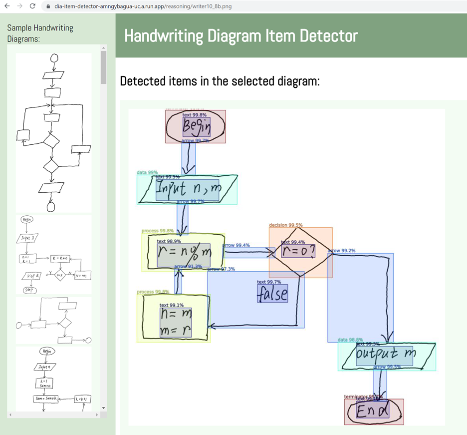

# Handwriting Diagram Item Detector <a href="https://dia-item-detector-amngybagua-uc.a.run.app/" target="_blank">Link</a> 

In this project, I developed an item detector from a handwriting diagram image to help engineers quickly and easily design system architectures.
In the first attempt, Faster R-CNN was applied. The detector can identify 'connection', 'data', 'decision', 'process', 'terminator', 'text', and 'arrow' from an image.

## 1. CNN model
### 1.1  Faster R-CNN
- Paper: "Faster R-CNN: Towards Real-Time Object Detection with Region Proposal Networks" <a href="https://arxiv.org/abs/1506.01497" target="_blank">Link</a>.

## 2. Test Web
- Handwriting Diagram Item Detector Test Web: <a href="https://dia-item-detector-amngybagua-uc.a.run.app/" target="_blank">Link</a>.

  

- Components
    - Web:
        - Google cloud run
        - Flask 
    - ML:
        - Pytorch
        - torchvision
        

